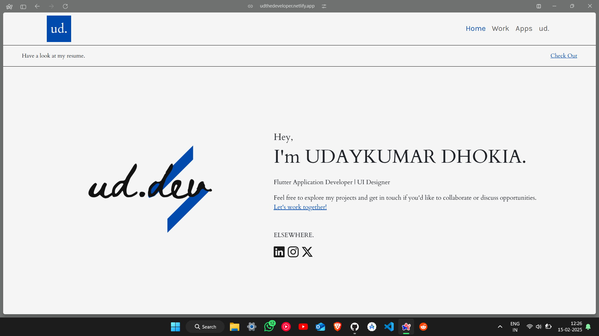

# UI Code Agent



## Overview

The UI Code Agent is a powerful tool designed to help you generate and test UI code snippets with AI assistance. This project leverages advanced AI models to create and validate UI components based on user input.

## Features

- **Code Generation**: Generates UI code snippets based on user input and requirements.
- **Code Testing**: Validates the generated code to ensure it meets the specified criteria.
- **Streamlit App**: Provides a user-friendly interface to input requirements and generate code.

## Installation

1. Clone the repository:
    ```sh
    git clone <repository-url>
    cd "UI Code Agent"
    ```

2. Install the required packages:
    ```sh
    pip install -r requirements.txt
    ```

3. Set up environment variables:
    ```sh
    cp .env.example .env
    # Update .env with your API keys
    ```

## Usage

1. Run the Streamlit app:
    ```sh
    streamlit run UI_Code_Agent.py
    ```

2. Open your browser and navigate to the provided URL.

3. Enter your UI requirements and click "Generate Code" to see the AI-generated content.

## Files

- `UI_Code_Agent.py`: Main script for the Streamlit app.
- `UI Code Agent.ipynb`: Jupyter notebook for development and testing.
- `demo_input.png`: Demo image showcasing the app.
- `output_code.html`: Example output file generated by the app.
- `requirements.txt`: List of required Python packages.
- `.env`: Environment variables file.
- `working_demo.mp4`: Video demonstrating the working of the app.

## Acknowledgements

- [Streamlit](https://streamlit.io/)
- [Gemini](https://gemini.com/)
